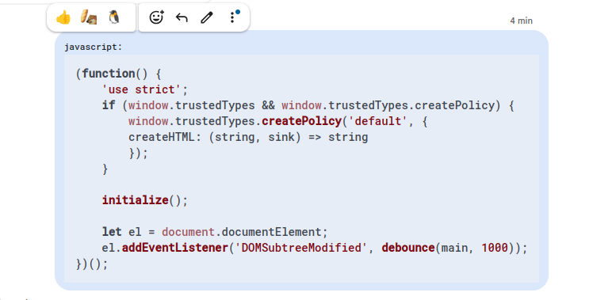
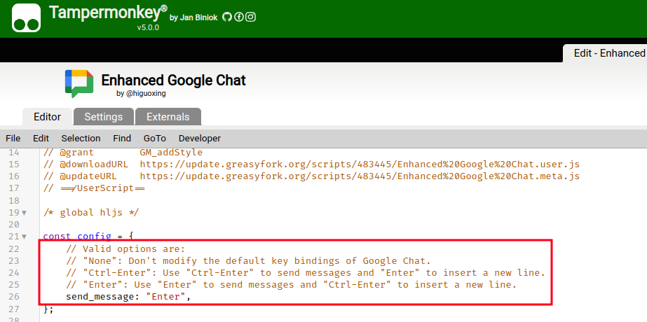

# Enhanced Google Chat

> A Tampermonkey script that brings missing features to Google Chat

## Features

- Code highlighting.
  
- Customize keybinding:
  - `Ctrl-Enter` to send a new message, `Enter` to input a new line.
  - `Enter` to send a new message, `Ctrl-Enter` to input a new line.
  - You need to modify the `config.send_message` field after installing it.
  
